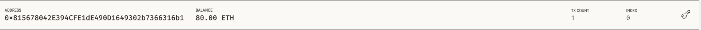
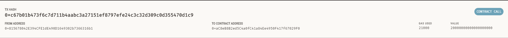

# Module 19 Challenge - Fintech Finder Application: Ethereum Transaction Functions

## Description

Building an application called, "Fintech Finder", that allows customers to search for Fintech professionals among a list of canadates, hire them and pay them.  This application utilizes the Ethereum blockcahin network allowing for the customer to instantly pay the candidate who they hired with cryptocurrency.

The sections of this project are as follows: 

* Import Ethereum Transaction Functions into the Fintech Finder Application 
* Sign and Execute a Payment Transaction
* Inspect the Transaction (This section is located in this README file to demonstrate the functionality of the application.)

---

## Inspect the Transaction

The following screenshots demonstrates the home application page, as well as a completed transaction that is verified in Ganache.   

In the following application example, the user selected "Lane" for 100 hours.  Lane's hourly rate is .2 Ether/Hour, so the total wage due in Ether is 20.0.  After confirming the details, the user clicks the "Send Transaction" button.  The transaction can be confirmed by viewing the Validated Transaction Hash that is generated.    


To confirm this transaction was completed, we can view our account details in Ganache to review our address, balance, and transaction (TX) count.  We know that this account started with 100 Ether, and the following screenshot indicates that 20 Ether was sent, leaving us with a current balance of 80 Ether.  



To review the transaction details, navigate to the Ganache Transaction tab where the details can be viewed: 



---

## Technologies

This project leverages Python 3.7.  The following packages are also used: 

* [Streamlit](https://github.com/streamlit) - Tool to build user friendly, web based data apps in Python

* [Web3.py](https://web3py.readthedocs.io/en/stable/overview.html) - Python library for connecting and performing operations on Ethereum-based blockchains.

* [ethereum-tester](https://pypi.org/project/ethereum-tester/0.1.0a4/) - Python library to provide access to the tools to test Etherum-based applications.

* [Ganache](https://www.trufflesuite.com/ganache) - Program that allows for quickly seeting up a local blockchain to use to test and develop blockchain based apps.

---

## Installation Guide

Before running the application, install Python modules Streamlit, web3 and ethereum-tester:

```python

  pip install streamlit

  pip install web3==5.17

  pip install eth-tester==0.5.0b3

```
Navigate to Ganache web page to install Ganache.

---

## Run Application

From your terminal, navigate to the project folder that contains your `.env` file and the `fintech_finder.py` and `crypto_wallet.py` files.
Be sure to activate your Conda `dev` environment if it is not already active. To launch the Streamlit application, type:

```python

  streamlit run fintech_finder.py

```
---

## Contributors

Joshua Creveling

Email: josh.creveling22@gmail.com

GitHub: https://github.com/joshuacreveling

LinkedIn: https://www.linkedin.com/in/joshua-creveling/

*Starter template provided by Trilogy Education Services*

---

## License

MIT
